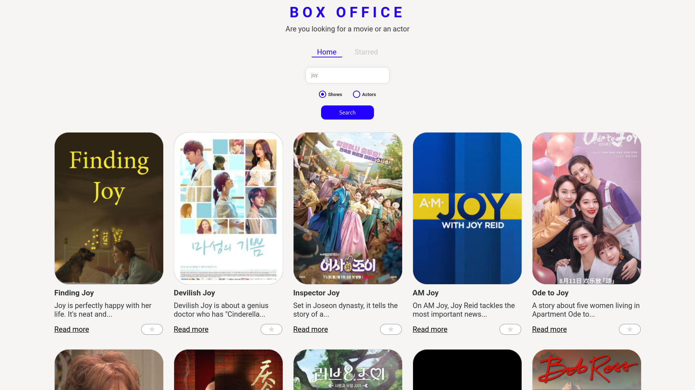
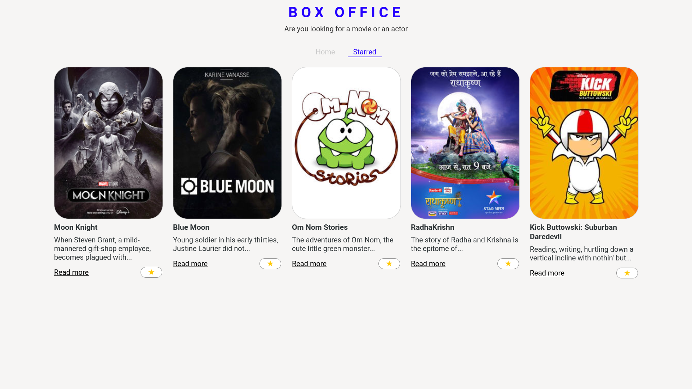
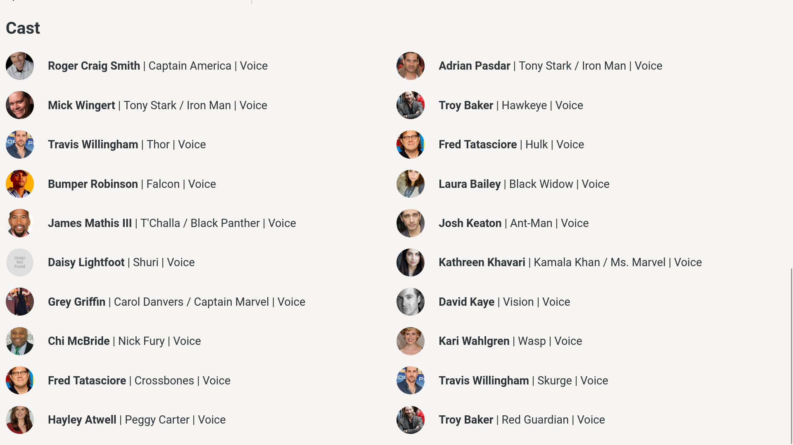

  

<!-- PROJECT LOGO -->
<br />
<div align="center">
  <a href="https://gauravs-box-office.surge.sh">
    
  </a>
  
  <h3 align="center"><b>BOX OFFICE</b></h3>

  <p align="center">
    Box Office provides you with a tons of features with other apps don't. You can easily find all information of any movie or actor and save them this information for future use.
    <br />
    <a href="#"><strong>Explore the docs »</strong></a>
    <br />
    <br />
    <a href="https://gauravs-box-office.surge.sh" style="color:orange; font-weight:bold">Search Now!!</a>
    ·
    <a href="https://github.com/gv211432/box-office/issues">Report Bug</a>
    ·
    <a href="https://github.com/gv211432/box-office/issues">Request Feature</a>
  </p>
</div>

<!-- ABOUT THE PROJECT -->

## ☑️ About The Project

<br>


<br>

Box Office Movie Search is a content specific search engine with the aim to retrieve movie information given the contents of a user's query. The search engine relies on the OkapiBM25 algorithm and takes into consideration the text present in the overview, the title, the names of the cast, and the production companies of each movie.

This project is developed by [me](https://github.com/gv211432).



<br>
<br>

## ⚙️ Installation

### 1. Clone this repository

```js
git clone https://github.com/gv211432/box-office.git
```

### 2. Open the directory `tictactoe`

```
cd box-office
```

### 3. Then follow the following

<br>
<br>

# Getting Started with Create React App

This project was bootstrapped with [Create React App](https://github.com/facebook/create-react-app).

## Available Scripts

In the project directory, you can run:

### `yarn start`

Runs the app in the development mode.\
Open [http://localhost:3000](http://localhost:3000) to view it in the browser.

The page will reload if you make edits.\
You will also see any lint errors in the console.

### `yarn test`

Launches the test runner in the interactive watch mode.\
See the section about [running tests](https://facebook.github.io/create-react-app/docs/running-tests) for more information.

### `yarn build`

Builds the app for production to the `build` folder.\
It correctly bundles React in production mode and optimizes the build for the best performance.

The build is minified and the filenames include the hashes.\
Your app is ready to be deployed!

See the section about [deployment](https://facebook.github.io/create-react-app/docs/deployment) for more information.

### `yarn eject`

**Note: this is a one-way operation. Once you `eject`, you can’t go back!**

If you aren’t satisfied with the build tool and configuration choices, you can `eject` at any time. This command will remove the single build dependency from your project.

Instead, it will copy all the configuration files and the transitive dependencies (webpack, Babel, ESLint, etc) right into your project so you have full control over them. All of the commands except `eject` will still work, but they will point to the copied scripts so you can tweak them. At this point you’re on your own.

You don’t have to ever use `eject`. The curated feature set is suitable for small and middle deployments, and you shouldn’t feel obligated to use this feature. However we understand that this tool wouldn’t be useful if you couldn’t customize it when you are ready for it.

## Learn More

You can learn more in the [Create React App documentation](https://facebook.github.io/create-react-app/docs/getting-started).

To learn React, check out the [React documentation](https://reactjs.org/).

<br>

# More snaps





<p align="right">(<a href="#top">back to top</a>)</p>

## 📖 License

Licence details are given here.
[MIT](https://github.com/gv211432/box-office/blob/main/LICENSE)
